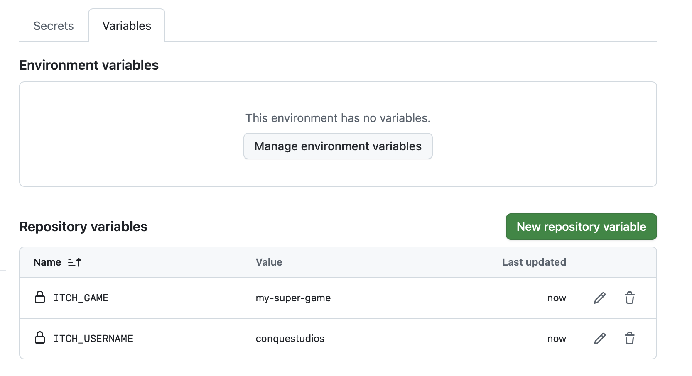
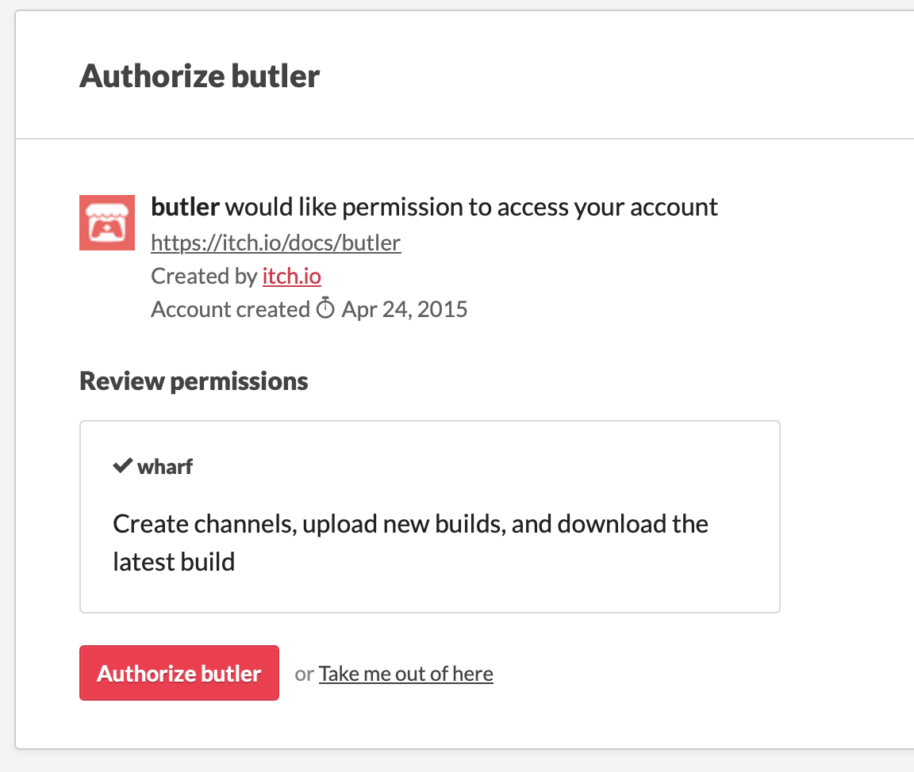
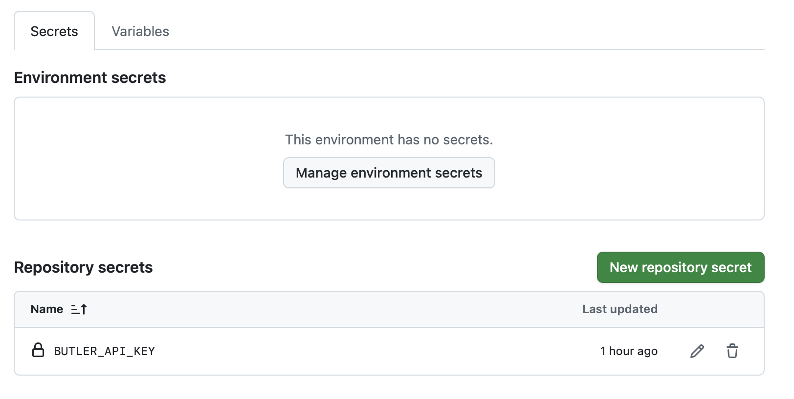

## How to Build and Publish my game using Github CICD?

**GitHub** is a platform that hosts your project’s source code online, making it easy to collaborate, track changes, and share your game with others.

**CI/CD** (Continuous Integration and Continuous Deployment) refers to automating the process of building, testing, and publishing your game whenever you make updates. The idea is to speed up your game's release process so you can push updates frequently, to fix bugs quicker or add more game content.

Using GitHub Actions, you can set up **workflows that automatically compile your Godot project** and **upload it to platforms** like itch.io whenever you tag a new release. This saves time, reduces manual errors, and helps keep your build and release process smooth and repeatable.

I recommend that for your first game release, you create it manually, and then only use this CICD workflow to speed things up.

## Prerequisites

Before following this guide, make sure you have the following in place:

- **GitHub Account & Repository:** Your Godot project should be pushed to a GitHub repository. If you haven’t yet, create one and upload your project files.
- **Itch.io Account:** You’ll need an itch.io account to publish your game. Create one at itch.io if you don’t have it yet.
- **Godot Export Presets Configured:** Ensure your export_presets.cfg file is properly configured in Godot for each platform you want to build (Windows, macOS, Linux, Web). The `build-and-publish.yml` will **trigger** these build config by name.

## How to trigger the CICD?

When you’re ready to publish a new version of your game, create a **GitHub release** tied to a version tag on the `main` branch. Using releases helps track updates, distribute builds, and communicate changes to players or testers.

A new release will trigger the `build-and-publish.yml` workflow, which will **build your game** in the cloud and **publish it** to itch.io (if everything is setup).

1. Ensure all desired changes are merged into the `main` branch. This is the version that'll get build and published.
2. On Github, go to Release, then **draft a new release** ([here is a step by step guide](https://docs.github.com/en/repositories/releasing-projects-on-github/managing-releases-in-a-repository#creating-a-release)). Create a new tag on you `main` branch using [semantic versioning](https://semver.org/). As a best practice, also prefix it with `v` in Github.
   - `x.0.0` — Major Release. Large updates or milestones (e.g., new game systems, overhauled visuals, major gameplay changes). Example: `v1.0.0` for the full launch.
   - `x.y.0` — Minor Update. New content or features that expand gameplay but remain backward-compatible. Example: `v1.1.0` for new levels or mechanics.
   - `x.y.z` — Patch / Hotfix. Small updates, bug fixes, performance improvements, or balancing tweaks. Example: `v1.1.3` for fixing a crash or visual glitch.
3. Publish the release. This will trigger the CICD in Github Action. Monitor its execution in the Actions tab on Github.

Now, before creating a new Release, let's setup your game build and itch.io connection.

## Setup your game build

### 1. Adapt the `build-and-publish.yml` file

**Edit your game's name:** Change the `EXPORT_NAME` to fit the name of your game. This will be the name of the file your players download.

```yml
EXPORT_NAME: your-game
# NOTE: If your `project.godot` is at the repository root, set `PROJECT_PATH` to "."
# If it's in a subdirectory, set it to the subdirectory name (e.g., "your-game")
PROJECT_PATH: .
```

**Edit Godot version:** By default, the workflow file is made for Godot 4.5. If you're using a different version, replace `GODOT_VERSION: 4.5` at the beginning of the file and all instances of `image: barichello/godot-ci:4.5` with your version. This workflow file uses [godot-ci](https://github.com/abarichello/godot-ci?tab=readme-ov-file) to build your game, so make sure the Godot version you're referring to is [available on Docker](https://hub.docker.com/r/barichello/godot-ci/tags)

### 2. MacOS specifics

#### MacOS Bundle name

In Godot, go to Project > Export... and then select MacOS.

You'll see that you have a field called "Bundle name" with default value `com.game.maaack-templaate`. Change this to be your game name.

#### MacOS Notarization

By default, your built game on MacOS will be flagged as dangerous and players will need to allow its execution by going into.

To avoid this, you need to notarize it, i.e. tell Apple who you are and what is your binary.

For that, you'll need first to create an Apple developer account (99USD/year). Then, you'll need to adapt the Export configuration of MacOS [using this guide](https://docs.godotengine.org/en/latest/tutorials/export/exporting_for_macos.html#if-you-have-an-apple-developer-id-certificate-and-exporting-from-linux-or-windows) to add **rcodesign** notarization and your Apple tokens.

## Setup Itch.io publication

### 1. Create a new project on itch.io

Go to [itch.io], click on the top right and **Upload a New Project**. Fill in the game name and any information you want, but don't upload any file. **Save the project as a Draft**.

### 2. Create a `ITCH_USERNAME` and `ITCH_GAME` variable

To find your itch.io username and the name of your game, look at the url of your project: `https://your-username.itch.io/your-game`. The username is the first part of the URL, and the game name is in the

Then, go to your Github repository Settings > Secrets and Variables > Actions. Then, select the **Variable** tab.

Create two variables: `ITCH_USERNAME` and `ITCH_GAME`. You should have something like this (with your real username and your real game name instead):



### 3. Create a `BUTLER_API_KEY` Github secret

1. Install [butler.](https://itch.io/docs/butler/installing.html) This is the official CLI tool for itch.io

2. Unzip and make sure the bin is executable

```bash
chmod +x butler
```

3. Run

```bash
butler login
```

This should open your browser. Login and allow butler to access your account.



In the terminal, the login flow will conclude with something like this:

```
Authenticated successfully! Saving key in /Users/username/Library/Application Support/itch/butler_creds...
```

4. Get your butler API key by reading the content of this file. Beware of spaces in the filepath! This will show you a 40 characters string which is your butler API key.

```bash
cat "/Users/username/Library/Application Support/itch/butler_creds"
```

> **Warning:** your butler API key is sensitive and secret. Do not share it with anyone and **do not** commit it to your repository and **do not** add it directly to the workflow file.

5. [Create a new Github secret](https://docs.github.com/en/actions/how-tos/write-workflows/choose-what-workflows-do/use-secrets) for your Github repository by going into Settings > Secrets and Variables > Actions and selecting the Secrets tab. Call the secret `BUTLER_API_KEY` and inside, paste the result of the previous step.



## Setup complete!

Congrats, you're ready to create a new Github Release and automatically publish updates.

## Next steps

Once your CI/CD pipeline is running smoothly, take it a step further:

- **Pre-Release Testing:** add a test stage in your workflow to validate your project before publishing (for example, by running Godot unit tests or verifying builds).
- **Multi-Platform Deployment:** add Android and iOS build.
- **Other Distribution Platforms:** adapt your CI/CD pipeline to push releases to other platforms like Steam, Google Play, or Epic Games Store later on, using their respective APIs and upload tools.
