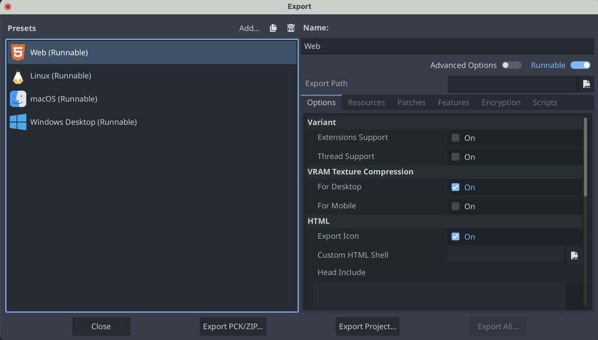
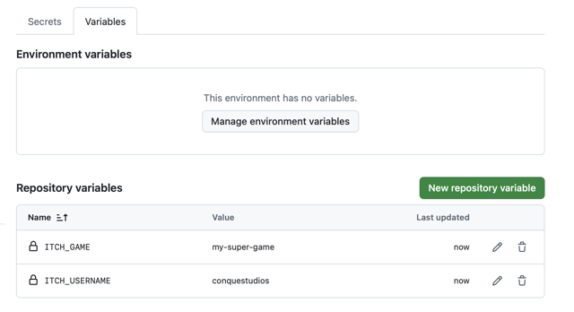
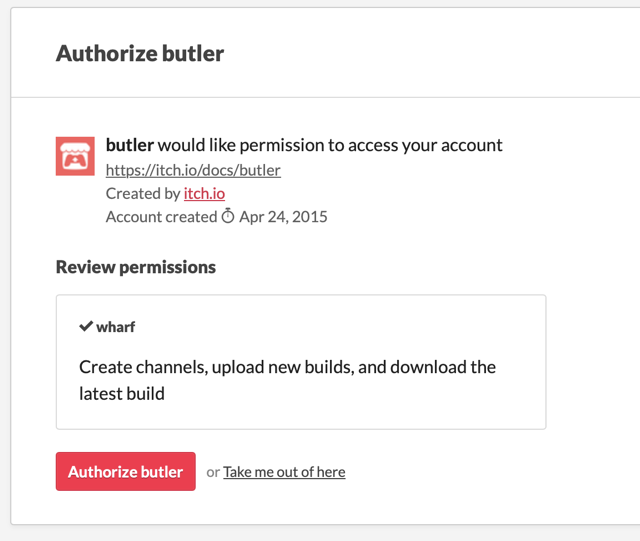
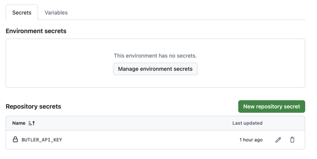
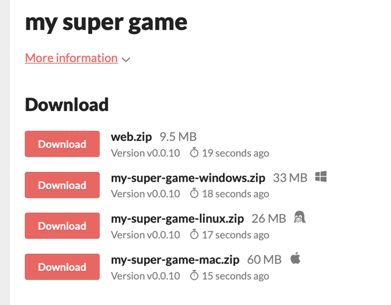
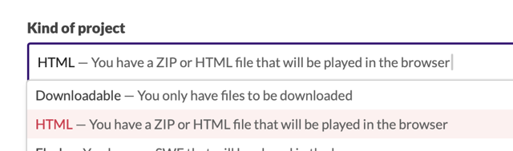
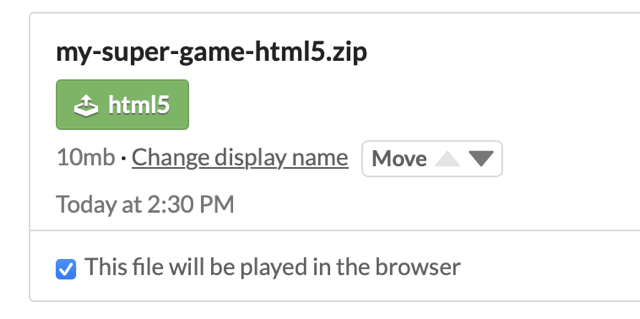
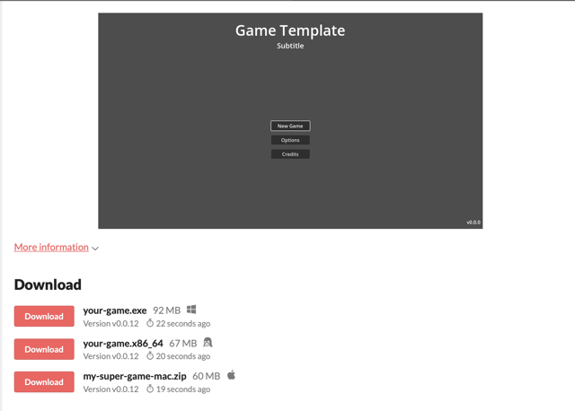

## How to Build and Publish my game using Github CICD?

**GitHub** is a platform that hosts your project’s source code online, making it easy to collaborate, track changes, and share your game with players, testers, or colleagues.

**CI/CD** (Continuous Integration and Continuous Deployment) refers to automating the process of building, testing, and publishing your game whenever you make updates. The idea is to speed up your game's release process so you can push updates frequently, to fix bugs quicker or add more game content.

Using GitHub Actions, you can set up **workflows that automatically compile your Godot project** and **upload it to platforms** like itch.io whenever you tag a new release. This saves time, reduces manual errors, and helps keep your build and release process smooth and repeatable.

**How does it work?** Once everything is set up, publish a new version of your game by creating a new **Github Release**. This will trigger the Github Action, that will build your game in the cloud and publish it to itch.io with a nice version tag.

> Note: You can set up all of this and still keep your game as a _Draft_ on itch.io. This is great for playtesting!

## Prerequisites

Before following this guide, make sure you have the following in place:

- **GitHub Account & Repository:** Your Godot project should be pushed to a GitHub repository. If you haven’t yet, create one and upload your project files.
- **Itch.io Account:** You’ll need an itch.io account to publish your game. Create one at itch.io if you don’t have it yet.

## Setup your game build

### 1. Setup exports for your game in Godot

First, open your game in Godot. Go to Project > Export... and make sure to add the following exports:

- `Web`
- `Linux`
- `macOS`
- `Windows Desktop`



Then, run the export for one platform manually **at least once.** This will create a `export_presets.cfg` file at the root of your project.

The `build-and-publish.yml` will **trigger** the build configs in `export_presets.cfg` **by name**. So make sure that your exports names are the same as in the list above. You can change the names or add more build configs with small edits to `build-and-publish.yml`.

#### Additional Git setup
Some version of Godot will add `export_presets.cfg` to `.gitignore` automatically. You'll want to remove that, so that git checks in your export configuration file with the rest of your code.

#### Additional MacOS setup

##### MacOS Bundle name

For MacOS, you have a field called "Bundle name" with default value `com.game.maaack-template`. Change this to be your game name.

##### MacOS Notarization

By default, your built game on MacOS will be flagged as dangerous. Players will need to allow its execution by going into _System Settings > Privacy & Security_, allow the app execution, and restart the game.

To avoid this, you need to notarize your game, i.e. tell Apple who you are and what is your binary.

For that, you'll need first to create an Apple developer account (99USD/year). Then, you'll need to adapt the Export configuration of MacOS [using this guide](https://docs.godotengine.org/en/latest/tutorials/export/exporting_for_macos.html#if-you-have-an-apple-developer-id-certificate-and-exporting-from-linux-or-windows) to add **rcodesign** notarization and your Apple tokens.

### 2. Create `GODOT_VERSION` and `EXPORT_NAME` variables

Go to your Github repository Settings > Secrets and Variables > Actions. Then, select the **Variables** tab.

Create two **Repository Variables**: `GODOT_VERSION` and `EXPORT_NAME`. 

> [!NOTE]  
> Repository variables will be available for this Github repository only, [but you can do more complex stuff if required](https://docs.github.com/en/actions/how-tos/write-workflows/choose-what-workflows-do/use-variables).  
> Using variables is great, because repo admins can still see these values in Github and edit them.

Change the `EXPORT_NAME` to fit the name of your game. This will be the name of the file your players download.

By default, the workflow file is made for Godot 4.5, but you can set `GODOT_VERSION` to the version of Godot for your project. This will be used for loading container images and export templates. This workflow file uses [godot-ci](https://github.com/abarichello/godot-ci?tab=readme-ov-file) to build your game, so make sure the Godot version you're referring to is [available on Docker.](https://hub.docker.com/r/barichello/godot-ci/tags)

### 3. Copy the `build-and-publish.yml` file

Copy the file `addons/maaacks_game_template/extras/scripts/build-and-publish.yml` into the `.github/workflows` folder at the root of your github repository.

Then, push the file to github on your main branch. The workflow file will be detected by github as a Github Action.

### 4. (Optional) Edit the export platforms

The workflow file is made in two parts:

1. First, it builds your game
2. Then, it pushes the builds to itch.io

By default, the workflow file tries to build configs named `Web`, `Linux`, `macOS` and `Windows Desktop`, and will fail if one of the configs is not available.

#### Deleting a platform

If you **don't want** to export to one platform, **delete** the build jobs and the publish steps in the `build-and-publish.yml`.  

For example, if you don't want to export for macOS, delete this part which builds the artifact:

```yml
  export-mac:
    name: macOS Export
    runs-on: ubuntu-24.04
    container:
      image: barichello/godot-ci:${{ vars.GODOT_VERSION }}
    steps:
      - name: Checkout
        uses: actions/checkout@v4
        with:
          lfs: true

      - name: Setup
        run: |
          mkdir -v -p ~/.local/share/godot/export_templates/
          mkdir -v -p ~/.config/
          mv /root/.config/godot ~/.config/godot || true
          mv /root/.local/share/godot/export_templates/${GODOT_VERSION}.stable ~/.local/share/godot/export_templates/${GODOT_VERSION}.stable || true

      - name: Mac Build
        run: |
          mkdir -v -p build/mac
          EXPORT_DIR="$(readlink -f build)"
          cd $PROJECT_PATH
          godot --headless --verbose --export-release "macOS" "$EXPORT_DIR/mac/${EXPORT_NAME}-mac.zip"

      - name: Upload to GitHub Release (if this run is a release)
        if: ${{ github.event_name == 'release' }}
        uses: svenstaro/upload-release-action@v2
        with:
          file: build/mac/${{ env.EXPORT_NAME }}-mac.zip

      - name: Upload Artifact
        uses: actions/upload-artifact@v4
        with:
          name: mac
          path: build/mac

```

Remove the job ID (ie. `export-mac`) from the needs of the `publish-builds` job:
```yml
  publish-builds:
    name: Publish Builds
    needs: [export-web, export-windows, export-linux, export-mac]
```

And remove this part, which publishes it to itch.io:

```yml
  - name: Upload to Itch.io - macOS
    run: |
      ./butler push builds/mac ${{ env.ITCH_USERNAME }}/${{ env.ITCH_GAME }}:mac --userversion "${{ steps.version.outputs.version }}"
```

#### Adding a platform
If you want to export to a **new** platform, **copy paste** the build job and add a new step to itch.io publication.

In the build job, change:
   1. the name of the **export config** that you created in Godot.
   2. the paths in which the build artifact is created.  

For example:

```yml
- name: NEW_PLATFORM Build
  run: |
      mkdir -v -p build/NEW_PLATFORM
      EXPORT_DIR="$(readlink -f build)"
      cd $PROJECT_PATH
      godot --headless --verbose --export-release "BUILD_CONFIG_NAME" "$EXPORT_DIR/NEW_PLATFORM/$EXPORT_NAME.zip"
```

In the itch.io publication step, make sure to change the path and the tag.

```yml
- name: Upload to Itch.io - NEW_PLATFORM_TAG
      run: |
      ./butler push builds/NEW_PLATFORM ${{ env.ITCH_USERNAME }}/${{ env.ITCH_GAME }}:NEW_PLATFORM_TAG --userversion "${{ steps.version.outputs.version }}"

```

## Setup Itch.io publication

### 1. Create a new project on itch.io

1. Go to [itch.io](https://itch.io/), click on the top right and **Upload a New Project**.

2. Fill in the game name and any information you want, but don't upload any file.

3. If you plan to have a **Web build**, select the **Kind of project** to be **HTML** instead of **Downloadable**.

4. Save the project as a **Draft** (you can change this to public later, once you tested that everything works).

### 2. Create `ITCH_USERNAME` and `ITCH_GAME` variables

To find your itch.io username and the name of your game, look at the url of your project: `https://your-username.itch.io/your-game`. The username is the first part of the URL, and the game name is in the last part.

Then, go to your Github repository Settings > Secrets and Variables > Actions. Then, select the **Variables** tab.

Create two **Repository Variables**: `ITCH_USERNAME` and `ITCH_GAME`.

You should have something like this (with your real username and your real game name instead, and any other repository variables):



### 3. Create a `BUTLER_API_KEY` Github secret

1. Install [butler.](https://itch.io/docs/butler/installing.html) This is the official CLI tool for itch.io

2. Unzip and make sure the bin is executable

   ```bash
   chmod +x butler
   ```

3. Run

   ```bash
   butler login
   ```

   This should open your browser. Login and allow butler to access your account.

   

   In the terminal, the login flow will conclude with something like this:

   ```
   Authenticated successfully! Saving key in /Users/username/Library/Application Support/itch/butler_creds...
   ```

   **Note:** if you're already logged in into butler but forgot the path to credentials, use `butler login -h` to show the default location of `butler_creds`.

4. Get your butler API key by reading the content of this file. Beware of spaces in the filepath! This will show you a 40 characters string which is your butler API key.

   ```bash
   cat "/Users/username/Library/Application Support/itch/butler_creds"
   ```

   > **Warning:** your butler API key is sensitive and secret. **Do not** share it with anyone, **do not** commit it to your repository, and **do not** add it directly to the workflow file.

5. [Create a new Github secret](https://docs.github.com/en/actions/how-tos/write-workflows/choose-what-workflows-do/use-secrets) for your Github repository. Go into Settings > Secrets and Variables > Actions and select the **Secrets** tab.

   Create a new **Repository Secret** with name `BUTLER_API_KEY` (this secret will be available only in this repository). Inside, paste the 40 characters string of the previous step.

   

   > It's important to use Github Secrets here because their values are encrypted and hidden from everyone, even repo admins. This ensures privacy and security.

## How to publish the game?

Congrats, you're ready to create a new Github Release and automatically publish updates!

When you’re ready to publish a new version of your game, create a **GitHub release** tied to a version tag on the `main` branch. Using releases helps track updates, distribute builds, and communicate changes to players or testers.

A new release will trigger the `build-and-publish.yml` workflow, which will **build your game** in the cloud and **publish it** to itch.io (if everything is setup).

1. Ensure all desired changes are merged into the `main` branch. This is the version that'll get built and published.
2. On Github, go to **Release**, then **draft a new release** ([here is a step by step guide](https://docs.github.com/en/repositories/releasing-projects-on-github/managing-releases-in-a-repository#creating-a-release)). Create a new tag on you `main` branch using [semantic versioning](https://semver.org/). As a best practice, also prefix it with `v` in Github.
   - `x.0.0` — Major Release. Large updates or milestones (e.g., new game systems, overhauled visuals, major gameplay changes). Example: `v1.0.0` for the full launch.
   - `x.y.0` — Minor Update. New content or features that expand gameplay but remain backward-compatible. Example: `v1.1.0` for new levels or mechanics.
   - `x.y.z` — Patch / Hotfix. Small updates, bug fixes, performance improvements, or balancing tweaks. Example: `v1.1.3` for fixing a crash or visual glitch.
3. Publish the release. This will trigger the CICD in Github Actions. Monitor its execution and check for errors in the **Actions** tab on Github.

## Troubleshooting: Enable the HTML / Playable version of your game on itch

It may happen that you don't see the HTML version of your game as playable, but just as a file.



What you need to do is edit your itch project to change the **Kind of project** to be **HTML** instead of **Downloadable**.



Then, edit the `html5` channel and toggle **This file will be played in the browser**.



Going back to your project page, you should now see the HTML version of your game playable in the browser on itch.io page.



## Next steps

Once your CI/CD pipeline is running smoothly, take it a step further:

- **Pre-Release Testing:** Add a test stage in your workflow to validate your project before publishing (for example, by running Godot unit tests or verifying builds).
- **Multi-Platform Deployment:** Add Android and iOS build, or remove the builds you don't use.
- **Other Distribution Platforms:** Adapt the CI/CD pipeline to push releases to other platforms like Steam, Google Play, App Store, Epic Games Store...
- **Add notarization for MacOS:** That's a best practice for a smoother experience.

## Sources

- **GitHub Documentation**

  - [Creating a Release on GitHub](https://docs.github.com/en/repositories/releasing-projects-on-github/managing-releases-in-a-repository#creating-a-release)
  - [Using GitHub Secrets in Workflows](https://docs.github.com/en/actions/how-tos/write-workflows/choose-what-workflows-do/use-secrets)

- **Semantic Versioning**

  - [Semantic Versioning 2.0.0](https://semver.org/)

- **Godot CI / Docker**

  - [abarichello/godot-ci (GitHub)](https://github.com/abarichello/godot-ci?tab=readme-ov-file)
  - [barichello/godot-ci Docker Hub Tags](https://hub.docker.com/r/barichello/godot-ci/tags)

- **Godot Engine Documentation**

  - [Exporting for macOS (with Apple Developer ID)](https://docs.godotengine.org/en/latest/tutorials/export/exporting_for_macos.html#if-you-have-an-apple-developer-id-certificate-and-exporting-from-linux-or-windows)

- **itch.io Resources**

  - [itch.io Main Website](https://itch.io/)
  - [Butler CLI Installation Guide](https://itch.io/docs/butler/installing.html)
