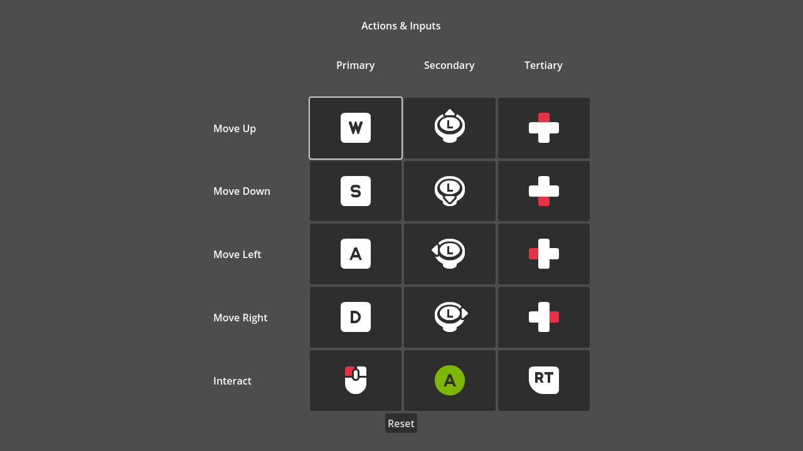
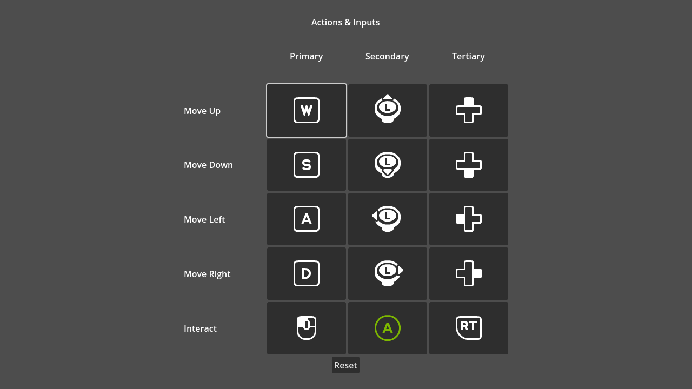
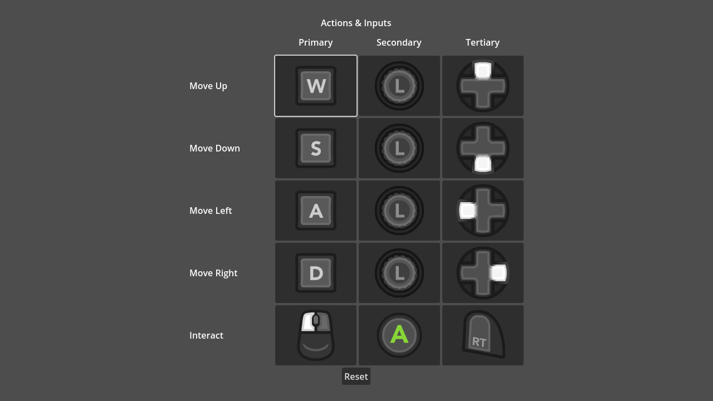
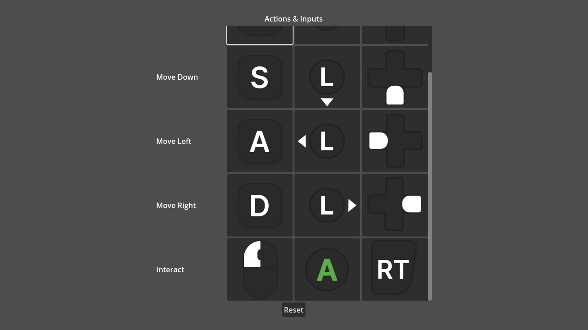

# Input Icon Mapping

The `InputIconMapper` in `input_options_menu.tscn` is a generalized tool meant to be broadly compatible with freely licensed icon asset packs. Instructions on how to use it with a few of these packs are provided, with links to download them from their creator's page.

## Kenney Input Prompts

### Automatic

> [!IMPORTANT]  
> Save the state of the project, and close all open scenes and scripts.

With the project open, select `Project > Tools > Use Input Icons for Maaack's Game Template`.

Select a style and then wait for the icons to download, extract, and setup.

> [!WARNING]  
> This may crash the editor.  
> In that event, check if the process completed, and try running the setup again.

### Manual

Available from [kenney.nl](https://kenney.nl/assets/input-prompts) and [itch.io](https://kenney-assets.itch.io/input-prompts).

This pack is organized by `Device/IconType`. The `IconTypes` for each device are just `Default`, `Vector`, or `Double`. These instructions will assume using `Default`. In the inspector of `InputIconMapper`, set the `directories` to include the subdirectories of the asset pack.  
* `.../kenney_input-prompts/Keyboard & Mouse/Default`  
* `.../kenney_input-prompts/Generic/Default`  
* `.../kenney_input-prompts/Xbox Series/Default`  
* `.../kenney_input-prompts/PlayStation Series/Default`  
* `.../kenney_input-prompts/Nintendo Switch/Default`  
* `.../kenney_input-prompts/Steam Deck/Default`  

Set `filtered_strings` to:
* `keyboard`
* `color`
* `button`
* `arrow`

Set `replace_strings` with the key pairs:  
* `"Capslock": "Caps Lock"`  
* `"Generic Stick": "Generic Left Stick"`  
* `"Guide": "Home"`  
* `"Slash Back": "Back Slash"`  
* `"Slash Forward": "Slash"`  
* `"Stick L": "Left Stick"`  
* `"Stick R": "Right Stick"`  
* `"Trigger L 1": "Left Shoulder"`  
* `"Trigger L 2": "Left Trigger"`  
* `"Trigger R 1": "Right Shoulder"`  
* `"Trigger R 2": "Right Trigger"`  

#### Filled Icons

Under the `FileLister` properties of the `InputIconMapper`, expand the `Constraints` and `Advanced Search` tabs. Set `ends_with=".png"` and `not_ends_with="outline.png"`.

Press `Refresh Files`.

If you want to use colored icons, in `prioritized_strings` add `color`. Otherwise set `filter="color"`.  

Press `Match Icons to Inputs`.  

Validate the results by inspecting the `matching_icons` dictionary.

#### Outlined Icons

Not all icons have outlined versions, so we will end up including the filled icons as fallback, and prioritizing outlined.

Under the `FileLister` properties of  the `InputIconMapper`, expand the `Constraints` and `Advanced Search` export groups. Set `ends_with=".png"`. 

Press `Refresh Files`. 

Add to `filtered_strings`:
* `outline`

In `prioritized_strings` add `outline`. If you want to use colored icons, in `prioritized_strings` add `color`, too. Otherwise set `filter="color"`.  

Press `Match Icons to Inputs`.  

Validate the results by inspecting the `matching_icons` dictionary.

## Kenny Input Prompts Pixel 16x

Incompatible: File names not useable.

## Xelu 's Free Controller & Key Prompts

Available from [thoseawesomeguys.com](https://thoseawesomeguys.com/prompts/).

This pack is organized by `Device`. In the inspector of `InputIconMapper`, set the `directories` to include the subdirectories of the asset pack. Assumes using the `Dark` icon set with the keyboard and mouse.
* `.../Xelu_Free_Controller&Key_Prompts/Keyboard & Mouse/Dark` 
* `.../Xelu_Free_Controller&Key_Prompts/Xbox Series`  
* `.../Xelu_Free_Controller&Key_Prompts/PS5`  
* `.../Xelu_Free_Controller&Key_Prompts/Switch`  
* `.../Xelu_Free_Controller&Key_Prompts/Steam Deck`  

Under the `FileLister` properties of the `InputIconMapper`, expand the `Constraints` and `Advanced Search` tabs. Set `ends_with=".png"`.

Press `Refresh Files`. 

Set `filtered_strings` to:
* `dark`
* `key`

Set `replace_strings` with the key pairs:  
* `"Ps 5": "Playstation"`  
* `"Xbox Series X": "Xbox"`  
* `"Steam Deck": "Steamdeck"`
* `"L 1": "Left Shoulder"`
* `"R 1": "Right Shoulder"`
* `"L 2": "Left Trigger"`
* `"R 2": "Right Trigger"`
* `"Click": "Press"`

Set `add_stick_directions=true`.

Press `Match Icons to Inputs`.

Validate the results by inspecting the `matching_icons` dictionary.

Since `Generic` device icons are not available, set `initial_joypad_device` to either `Xbox`, `Playstation`, `Switch`, or `Steamdeck`.

## Free Icon Pack for Unity & Unreal – 1500+ Input Icons for Game UI

Available from [itch.io](https://juliocacko.itch.io/free-input-prompts).

This pack is organized by `Device/IconType`. In the inspector of `InputIconMapper`, set the `directories` to include the subdirectories of the asset pack. Assumes using the `Dark` icon set with the keyboard and mouse, and `Default` for the others.
* `.../Source/Keyboard_Mouse/Dark` 
* `.../Source/P4Gamepad/Default`  
* `.../Source/XGamepad/Default`  
* `.../Source/SGamepad/Default`  

Under the `FileLister` properties of the `InputIconMapper`, expand the `Constraints` and `Advanced Search` tabs. Set `ends_with=".png"`.

Press `Refresh Files`. 

In `prioritized_strings`, add either `color` or `white`, depending on what icons you prefer.

Set `filtered_strings` to:
* `dark`
* `key`
* `t`
* `color`
* `white`

Set `replace_strings` with the key pairs:  
* `"P 4": "Playstation"`  
* `"X": "Xbox"`  
* `"S": "Switch"`
* `"L": "Left Stick"`
* `"R": "Right Stick"`
* `"Left Stick 1": "Left Shoulder"`
* `"Right Stick 1": "Right Shoulder"`
* `"Left Stick 2": "Left Trigger"`
* `"Right Stick 2": "Right Trigger"`

Press `Match Icons to Inputs`.

Validate the results by inspecting the `matching_icons` dictionary.

Since `Generic` device icons are not available, set `initial_joypad_device` to either `Xbox`, `Playstation`, or `Switch`.
