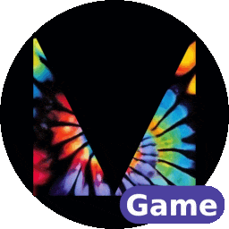

# Plugin Suite

Maaack's Game Template is a culmination of a suite of plugins, that can be downloaded individually, if desired.  

## GitHub

- [Game Template](https://github.com/Maaack/Godot-Game-Template) 
    - [Menus Template](https://github.com/Maaack/Godot-Menus-Template)
        - [Options Menus](https://github.com/Maaack/Godot-Options-Menus)
        - [Scene Loader](https://github.com/Maaack/Godot-Scene-Loader)
        - [Credits Scene](https://github.com/Maaack/Godot-Credits-Scene)
        - [UI Sound Controller](https://github.com/Maaack/Godot-UI-Sound-Controller)
        - [Music Controller](https://github.com/Maaack/Godot-Music-Controller)

## Godot Asset Library

- [Game Template](https://godotengine.org/asset-library/asset/2709) 
    - [Menus Template](https://godotengine.org/asset-library/asset/2899)
        - [Options Menus](https://godotengine.org/asset-library/asset/3058)
        - [Scene Loader](https://godotengine.org/asset-library/asset/2896)
        - [Credits Scene](https://godotengine.org/asset-library/asset/2932)
        - [UI Sound Controller](https://godotengine.org/asset-library/asset/2897)
        - [Music Controller](https://godotengine.org/asset-library/asset/2898)
