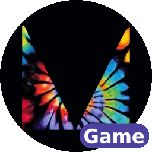

# Plugin Suite

Maaack's Game Templates are a culmination of a suite of plugins, that can be downloaded individually, if desired.  

## Hierarchy

- Game Template ( [Github](https://github.com/Maaack/Godot-Game-Template) | [Asset Library](https://godotengine.org/asset-library/asset/2709) )
    - Menus Template ( [Github](https://github.com/Maaack/Godot-Menus-Template) | [Asset Library](https://godotengine.org/asset-library/asset/2899) )
        - Options Menus ( [Github](https://github.com/Maaack/Godot-Options-Menus) | [Asset Library](https://godotengine.org/asset-library/asset/3058) )
            - Input Remapping ( [Github](https://github.com/Maaack/Godot-Input-Remapping) | [Asset Library](https://godotengine.org/asset-library/asset/4051) )
        - Scene Loader ( [Github](https://github.com/Maaack/Godot-Scene-Loader) | [Asset Library](https://godotengine.org/asset-library/asset/2896) )
        - Credits Scene ( [Github](https://github.com/Maaack/Godot-Credits-Scene) | [Asset Library](https://godotengine.org/asset-library/asset/2932) )
        - UI Sound Controller ( [Github](https://github.com/Maaack/Godot-UI-Sound-Controller) | [Asset Library](https://godotengine.org/asset-library/asset/2897) )
        - Music Controller ( [Github](https://github.com/Maaack/Godot-Music-Controller) | [Asset Library](https://godotengine.org/asset-library/asset/2898) )
- Minimal Game Template ( [Github](https://github.com/Maaack/Godot-Minimal-Game-Template) | [Asset Library](https://godotengine.org/asset-library/asset/4657) )
    - Options Menus ( [Github](https://github.com/Maaack/Godot-Options-Menus) | [Asset Library](https://godotengine.org/asset-library/asset/3058) )
        - Input Remapping ( [Github](https://github.com/Maaack/Godot-Input-Remapping) | [Asset Library](https://godotengine.org/asset-library/asset/4051) )

## Overview

  

